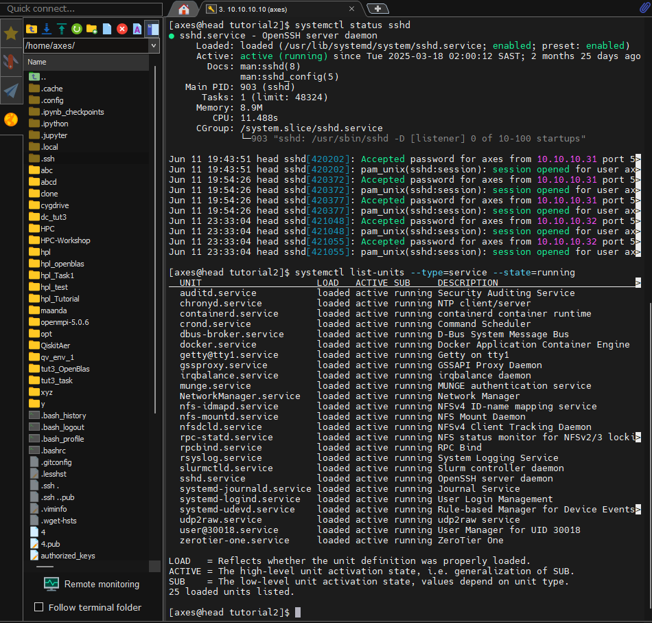
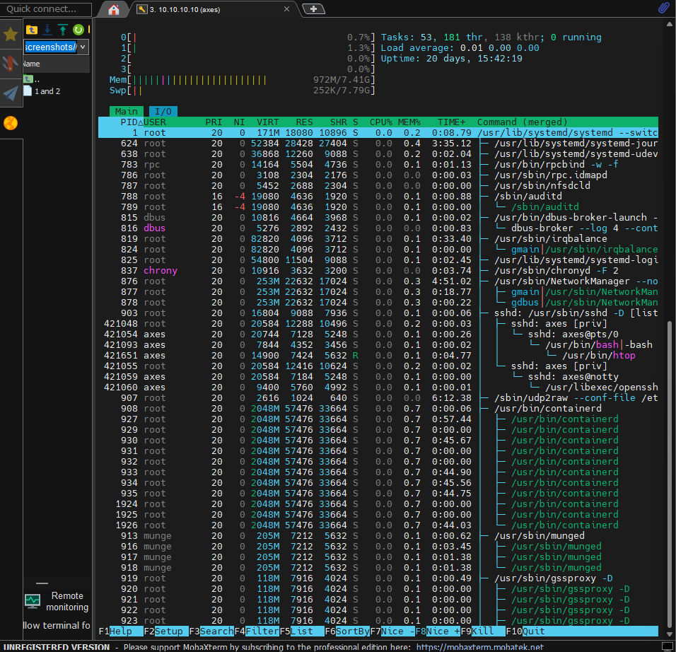
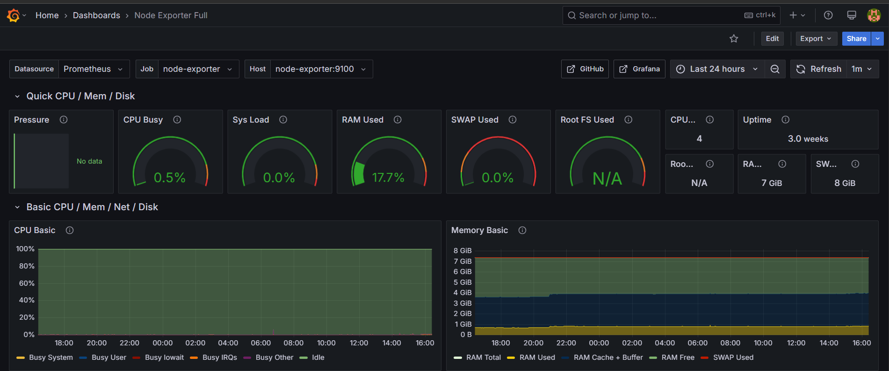
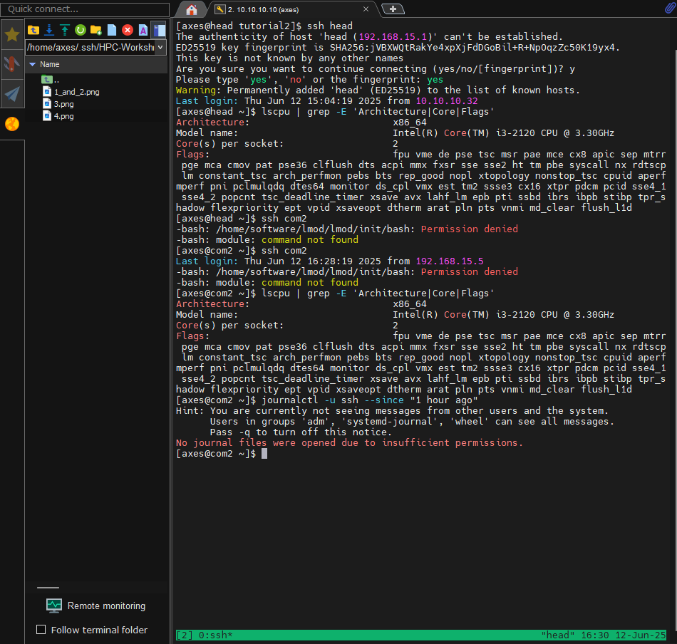

# AXES - Tutorial 3: Basic Linux Commands

## SSH service on the head node and all running services
###**Command:** *systemctl status ssh and systemctl list-units --type=service --state=running*

---
## SSH processes
### **Command:** *htop*

---
## Grafana "node-exporter:9100"

---
## Display CPU info from head and com2 using *tmux* *lscpu* *grep* and SSH logs

